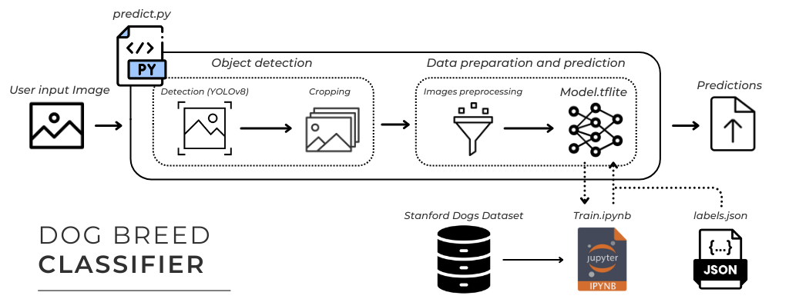

# Dog Breed Prediction using Stanford Dogs Dataset and YOLOv8

## Overview

This project utilizes a pre-trained model to predict the breed of dogs found in images. The model was trained using the "Stanford Dogs Dataset" and allows users to detect dogs in an image, then classify their breed with probability distributions for the top three possible breeds.

Key features:

- Detect dogs in images using **YOLOv8** object detection.
- Classify dog breeds based on the detected regions.
- Return the top 3 predicted breeds with their probabilities.
- Visualize the results by showing detected dogs and their predicted breeds.

## Project Workflow

1. **Training the model:**

- The model was trained using the "Stanford Dogs Dataset" which contains over 20,000 images of dogs across 120 breeds.
- A deep learning model was created to classify images into one of these 120 breeds.

2. **Predicting dog breeds (predict.py):**

- The script `predict.py` loads the pre-trained model.
- The user is prompted to select an image file.
- Using **YOLOv8**, dogs are detected in the image.
- Each detected dog is then passed to the classification model to predict its breed.
- The script outputs the top 3 predicted breeds with their probabilities along with the dogs images.



## Requirements

To run this project, you'll need the following dependencies installed in your Python environment:

- `opencv-python`
- `ultralytics` (YOLOv8)
- `tensorflow` (for the classification model)
- `numpy`
- `matplotlib`

You can install the dependencies with:  
pip install opencv-python ultralytics tensorflow numpy matplotlib

## How to Run

1. Clone the repository:

```
git clone https://github.com/GrindSC/Dog-breed-recognition.git
cd dog-breed-prediction
```

2. Run the prediction script:

```
python predict.py
```

3. When prompted, select the image file containing dogs. The script will detect the dogs and output the predicted breeds for each one, along with a probability distribution for the top 3 breeds. A visualization of the detection and predictions will also be displayed.

## Example

Below is an example of the output produced by the project after running the `predict.py` script on an image. The first image shows the detection result from **YOLOv8**, while the second image showcases the predicted breed of the detected dog with its corresponding probability distribution.  

Predicted dog breed: Great Pyrenees  
86.29% Great Pyrenees  
13.16% Kuvasz  
0.22% Clumber  


## Future Improvements

- Improving model accuracy by fine-tuning on a larger dataset.
- Adding support for more types of input images (e.g., from different image formats or URLs).
- Enhancing the prediction in a more complex scenarios (images in challenging environments).

## Stanford Dogs Dataset

The dataset used in this project can be found [here](http://vision.stanford.edu/aditya86/ImageNetDogs/). It contains 20,580 images of 120 breeds of dogs, making it one of the most comprehensive dog breed datasets available.
